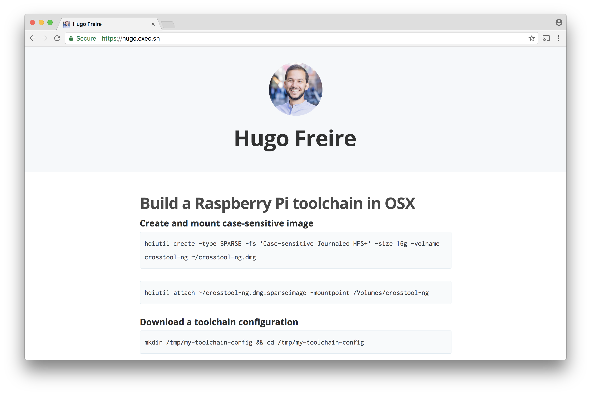

# My Ghost :pencil2::ghost: blog theme

> Ghost theme for personal blogging and note-taking

### Features
* Simple and :dizzy: lightweight theme for :ghost: [Ghost](https://github.com/TryGhost/Ghost) publishing platform :white_check_mark:

### How to contribute
You can contribute either with code (e.g., new features, bug fixes and documentation) or by [donating 5 EUR](https://paypal.me/hfreire/5). You can read the [contributing guidelines](CONTRIBUTING.md) for instructions on how to contribute with code. 

All donation proceedings will go to the [Sverige för UNHCR](https://sverigeforunhcr.se), a swedish partner of the [UNHCR - The UN Refugee Agency](http://www.unhcr.org), a global organisation dedicated to saving lives, protecting rights and building a better future for refugees, forcibly displaced communities and stateless people.

### License
Read the [license](./LICENSE.md) for permissions and limitations.
