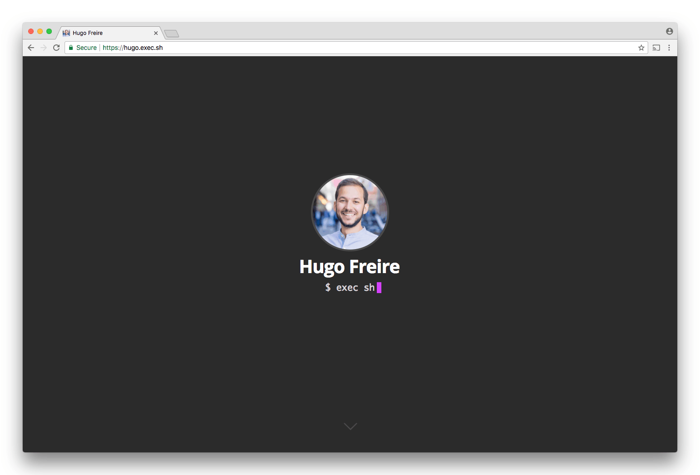

#  My personal website for blogging and :pencil2: note-taking 

[](https://github.com/hfreire/hugo-exec-sh/actions?workflow=ci)
[](https://github.com/hfreire/hugo-exec-sh/actions?workflow=cd)
[](https://coveralls.io/github/hfreire/hugo-exec-sh?branch=master)
[](https://snyk.io/test/github/hfreire/hugo-exec-sh)
[](https://github.com/hfreire/hugo-exec-sh/releases)
[](https://hub.docker.com/r/hfreire/hugo-exec-sh/)
[](https://hub.docker.com/r/hfreire/hugo-exec-sh/)

> Uses Ghost blogging platform for publishing and managing content online

<p align="center"></p>

### Features
* :ghost: [Ghost](https://github.com/TryGhost/Ghost) blogging platform publishing platform :white_check_mark:
* Simple and :dizzy: lightweight theme :white_check_mark:

### How to use

#### Use it in your terminal
Using it in your terminal requires [Docker](https://www.docker.com) installed in your system.

##### Run the Docker image in a container 
Detach from the container and expose port `5302`.
```
docker run -d -p "5302:3000" hfreire/hugo-exec-sh
```

### How to build
##### Clone the GitHub repo
```
git clone https://github.com/hfreire/hugo-exec-sh.git
```

##### Change current directory
```
cd hugo-exec-sh
```

##### Run the NPM script that will build the Docker image
```
npm run build
```

### How to deploy

#### Deploy it from your terminal
Deploying it from your terminal requires [terraform](https://www.terraform.io) installed on your system and an [antifragile infrastructure](https://github.com/antifragile-systems/antifragile-infrastructure) setup available in your [AWS](https://aws.amazon.com) account.

##### Clone the GitHub repo
```
git clone https://github.com/hfreire/hugo-exec-sh.git
```

##### Change current directory
```
cd hugo-exec-sh
```

##### Run the NPM script that will deploy all functions
```
npm run deploy
```

#### Available deployment environment variables
Variable | Description | Required | Default value
:---:|:---:|:---:|:---:
VERSION | The version of the app. | false | `latest`
ANTIFRAGILE_STATE_AWS_REGION | The AWS region used for the antifragile state . | false | `undefined`
ANTIFRAGILE_STATE_AWS_S3_BUCKET | The AWS S3 bucket used for the antifragile state. | false | `undefined`
ANTIFRAGILE_STATE_AWS_DYNAMODB_TABLE | The AWS DynamoDB table used for the antifragile state. | false | `undefined`
ANTIFRAGILE_INFRASTRUCTURE_DOMAIN_NAME | The domain used for the antifragile infrastructure. | true | `undefined`

### How to contribute
You can contribute either with code (e.g., new features, bug fixes and documentation) or by [donating 5 EUR](https://paypal.me/hfreire/5). You can read the [contributing guidelines](CONTRIBUTING.md) for instructions on how to contribute with code. 

All donation proceedings will go to the [Sverige för UNHCR](https://sverigeforunhcr.se), a swedish partner of the [UNHCR - The UN Refugee Agency](http://www.unhcr.org), a global organisation dedicated to saving lives, protecting rights and building a better future for refugees, forcibly displaced communities and stateless people.

### License
Read the [license](./LICENSE.md) for permissions and limitations.
